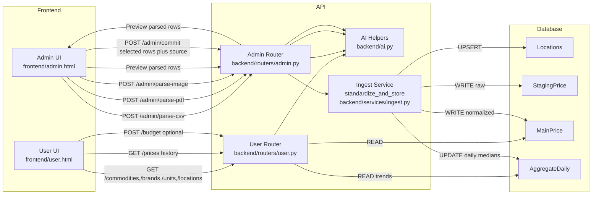
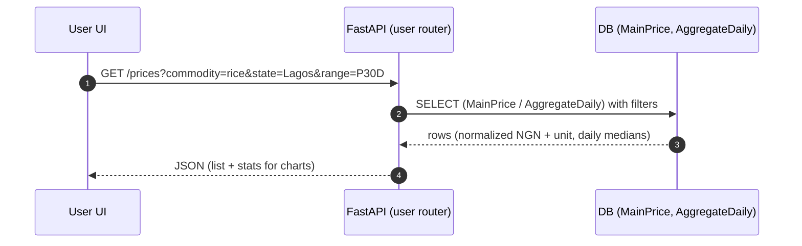
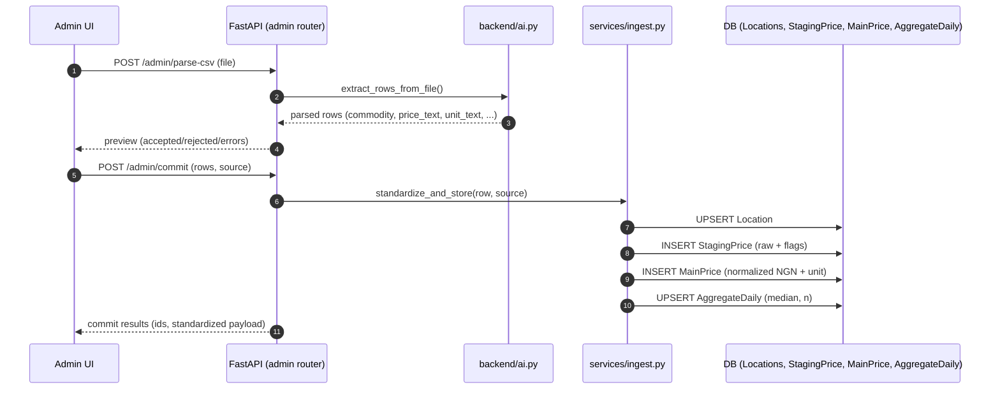

<div align="center">


# **S T P**
_A platform for clean, comparable commodity prices — query **standard** prices and **location‑specific** prices across Nigeria (state → city → market)._

**Service:** S T P API (AI) • v4.1.0

</div>

---

## TL;DR
- Ingest prices from CSV/PDF/Image or manual entry → **normalize units & currency** → validate → store.
- Users query:
  - **Standard price** (robust aggregates like median per window/location).
  - **Specific price** (latest per location with canonical unit/currency).
- API-first FastAPI service with SQLite by default; optional Gemini-powered extraction/budget tips.

---


# S T P — Data Flow & Model (README)

This document captures the **end‑to‑end data flow**, **request/response lifecycles**, and **data model** for the S T P Platform. It’s designed to be pasted directly into your project’s `README.md` on GitHub.

---

## Data Flow (End-to-End)

The system has two main paths: **User path** (read-only queries for prices/history/budgeting) and **Admin path** (data ingestion $\rightarrow$ normalization $\rightarrow$ storage $\rightarrow$ aggregation).



### What happens

- **Admin “parse”**: CSV/PDF/Image is parsed (optionally via Gemini) → preview rows with flags (valid/outlier).
- **Admin “commit”**: Accepted rows go through `standardize_and_store()`:
  - currency/unit parsing & normalization (`backend/utils.py`)
  - location upsert (`backend/validators.py`)
  - write to **StagingPrice** (raw) and **MainPrice** (normalized NGN + base unit)
  - recompute **AggregateDaily** median for *commodity × location × day*
- **User queries** read from **MainPrice** and **AggregateDaily** to render lists and charts.

---

## Request/Response Lifecycle (Typical)

### User: Query prices for a commodity/location/date range



### Admin: Parse → Preview → Commit



---


## Normalization & Validation (where it happens)

- **Price & currency parsing**: `parse_price_and_currency()`  
- **Unit cleaning**: `clean_unit()` → `(unit_value, unit_name)`  
- **Outlier flagging**: `iqr_outlier()` vs historical staging values  
- **Location upsert**: `validate_or_upsert_location()`  
- **Commit logic**: `standardize_and_store()` writes **StagingPrice** and **MainPrice**, then recomputes **AggregateDaily** medians.

---

## Implementation References

- `backend/services/ingest.py`  
- `backend/utils.py`  
- `backend/validators.py`  
- `backend/routers/admin.py`, `backend/routers/user.py`


## CSV Template (Minimum)

```csv
commodity,brand,price_text,unit_text,unit_value,unit_name,currency,state,city,market,date_uploaded,note
rice,Mama Gold,"75000",bag,50,kg,NGN,Lagos,Ikeja,Onigbongbo,2025-09-29,Retail quote
sugar,,95000,kg,1,kg,NGN,Kaduna,Chikun,Barnawa,2025-09-28,Wholesaler
cement,Dangote,7200,bag,50,kg,NGN,Abuja,AMAC,Garki,2025-09-30,Dangote 50kg
groundnut oil,,12000,liter,1,liter,NGN,Oyo,Ibadan North,Bodija,2025-09-30,Branded
```

- `price_text` may contain symbols/commas — the parser extracts the number & currency.
- **Always include `currency` and proper `unit_text`/`unit_value`** to prevent “75,000 becomes 750” type errors.
- `date_uploaded` in `YYYY-MM-DD` (defaults to “today” if omitted).

---

## Admin Ingestion Flow

1. **Parse**: Upload CSV/PDF/Image for preview parsing (`/admin/parse-csv`, `/admin/parse-pdf`, `/admin/parse-image`).
2. **Review**: The API returns standardized rows (accepted/rejected/errors). Frontend shows a preview.
3. **Commit**: Post selected rows to `/admin/commit` with a `source` label to persist into `MainPrice` and update `AggregateDaily`.

Manual single-entry is also supported (see `schemas.ManualEntry` and the admin router).


## Tech Stack

<div id="tech-stack"></div>

### Core

<table>
<tr>
  <td align="center">
    <br>
    Python 3.11+
  </td>
  <td align="center">
    <br>
    FastAPI
  </td>
  <td align="center">
    <br>
    SQLModel/SQLAlchemy
  </td>
  <td align="center">
    <br>
    SQLite (dev)
  </td>
  <td align="center">
    <br>
    Postgres (prod)
  </td>
</tr>
<tr>
  <td align="center">
    <br>
    HTML
  </td>
  <td align="center">
    <br>
    Vanilla JS
  </td>
  <td align="center">
    <br>
    TailwindCSS
  </td>
  <td align="center">
    <br>
    Docker
  </td>
  <td align="center">
    <br>
    GitHub Actions
  </td>
</tr>
</table>

## Typical stack :

**Backend / API**  
[](https://fastapi.tiangolo.com/) 
[](https://www.python.org/)

**DB / Warehouse**  
[](https://www.sqlite.org/) 
[-4169E1?style=for-the-badge&logo=postgresql&logoColor=white)](https://www.postgresql.org/) 
  

**Object Store**  
-6B7280?style=for-the-badge) 
[](https://min.io/) 
[](https://aws.amazon.com/s3/)

**Orchestration (optional)**  
[](https://airflow.apache.org/) 
[](https://www.prefect.io/) 
[](https://dagster.io/)

**Transforms (optional)**  
[](https://www.getdbt.com/) 
[](https://spark.apache.org/) 
[](https://www.pola.rs/)

**Validation / Data Quality (optional)**  
[](https://greatexpectations.io/) 
[](https://pandera.readthedocs.io/) 
[](https://docs.soda.io/)

**Frontend**  
[](https://developer.mozilla.org/docs/Web/HTML) 
[](https://developer.mozilla.org/docs/Web/JavaScript) 
[](https://tailwindcss.com/)

**Auth (optional)**  
 
 
[](https://supabase.com/)

**Observability (optional)**  
[](https://opentelemetry.io/) 
[](https://prometheus.io/) 
[](https://grafana.com/)

**CI / CD**  
[](https://github.com/features/actions)

**Containers**  
[](https://www.docker.com/) 


### Optional

- **AI Parsing**: Google Gemini (Vision/Text)
- **Charts**: Chart.js  
- **Validation**: Pandera / Great Expectations  
- **Orchestration**: Airflow / Prefect / Dagster  
- **Observability**: OpenTelemetry • Prometheus • Grafana  

> You can swap pieces freely; this repo keeps defaults minimal.

---


## User Features

- **Browse commodities**: `/commodities`, `/brands`, `/units`, `/locations`
- **Specific price**: latest normalized price for a commodity at a given location
- **Standard price**: robust aggregates (daily medians etc.) via `AggregateDaily`
- **Budgeting**: `/budget` — simple cart optimizer; may return a short Gemini tip if configured

Frontend (`user.html`) includes **Chart.js** for trends and filters for location/commodity.

---

## Running Notes

- First run creates SQLite tables and seeds locations (see `backend/database.py`).
- If you switch to Postgres, set `PRICING_DB_URL` accordingly and ensure drivers are installed.
- CORS is open (`*`) by default; tighten for production.

---

## Troubleshooting

- **Empty `requirements.txt`**: install the minimal stack using the command above.
- **Price scales look wrong**: confirm `unit_value`, `unit_name`, and `currency` are present in your CSV.
- **No rows after parse**: check file format/headers. The admin router contains header synonym mappings to auto-map common column names.
- **AI parsing slow/unavailable**: reduce `AI_MAX_CHARS`, increase timeout slightly, or disable Gemini usage.

---

## Roadmap (suggested)

- Historical FX table & per-day normalization
- Confidence scoring per source
- Geo-aware queries (nearest markets)
- Alerts on spikes/drops
- Role-based auth for admin routes

---

## License
MIT (see `LICENSE` if present).


